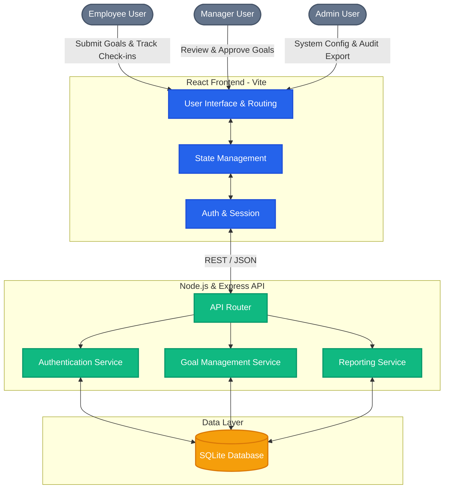

# Hackathon Submission: ApexOKR Portal

**Project Name:** ApexOKR - Enterprise Goal Setting & Tracking Portal  
**Track/Problem Statement:** Professional Goal Tracking Phase 1 & 2  

---

## 1. Working Link
*Please replace the placeholder below with your live deployed URL (e.g., Vercel, Render, or Netlify)*

🔗 **Live Portal:** `[Insert Live Deployed Link Here, e.g., https://apexokr.vercel.app]`

**Demo Credentials:**
- Employee: `employee@apexokr.com`
- Manager: `manager@apexokr.com`
- Admin: `admin@apexokr.com`

---

## 2. Source Code Repository
*Please replace the placeholder below with the link to your public Git repository.*

💻 **Repository:** `https://github.com/ShivrajSS-git/AtomquestHackathon2026-ApexOKR/tree/main`

---

## 3. Architecture Diagram
The following diagram outlines the high-level architecture of the ApexOKR application, illustrating the flow of data between the client, the API layer, and the database.

### Architecture Overview:
1. **Frontend (React.js + Vite):** A responsive, single-page application utilizing pure functional components and a custom dynamic CSS variable design system (Sapphire Light & Dark mode).
2. **Backend (Node.js + Express):** A lightweight RESTful API handling authentication, CRUD operations for goals/achievements, and role-based access control.
3. **Database (SQLite):** A fast, file-based relational database ensuring persistence of users, Phase 1 goal metrics, and Phase 2 quarterly achievements.
